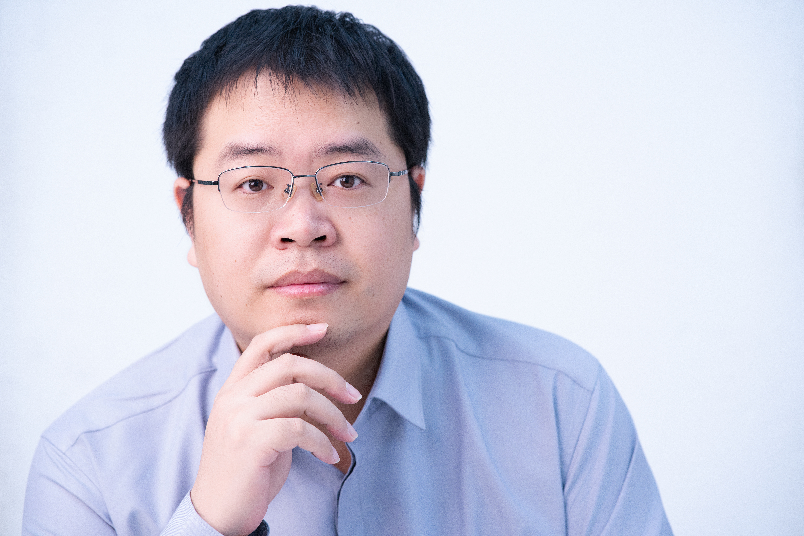

## Jia Li (李嘉)

**Associate Professor, School of Artificial Intelligence, Beijing Normal University** 

📧 jiali.gm AT gmail.com · jiali AT bnu.edu.cn 

My research interests include machine learning, optimization, and computer vision. My current research focuses on large language models for basic education, as well as efficient pre-training and post-training techniques. Before joining Beijing Normal University, I was a Boya Postdoctoral Researcher at Peking University, working with Prof. [Zhouchen Lin](https://zhouchenlin.github.io/). I received my Ph.D. in Computer Science from Beijing Jiaotong University in 2017, under the supervision of Prof. [Zhouchen Lin](https://zhouchenlin.github.io/) and Prof. [Jian Yu](https://faculty.bjtu.edu.cn/6463/).

---

### 🔥 Recruitment

I am hiring Master students and Undergraduate Research Interns!!! 

If you have strong mathematical abilities, are self-motivated, and are interested in using mathematics to solve real-world problems in an elegant way, please feel free to email me.

---

### 📝 Selected Publications

**† 通信作者**

1. Ziming Yu, Pan Zhou, Sike Wang, **Jia Li**†, Mi Tian, Hua Huang. Zeroth-order fine-tuning of LLMs in random subspaces. Proceedings of the International Conference on Computer Vision (ICCV), 2025.
   
1. Sike Wang, Pan Zhou, **Jia Li**†, Hua Huang. 4-bit Shampoo for memory-efficient network training. Advances in Neural Information Processing Systems (NeurIPS), 2024.
   
1. **Jia Li**, Chenyan Bai, Hua Huang. Universal demosaicking for interpolation-friendly RGBW color filter arrays. IEEE Transactions on Image Processing (TIP), Vol. 32, pp.3592-3605, 2023.
   
1. **Jia Li**, Mingqing Xiao, Cong Fang, Yue Dai, Chao Xu, Zhouchen Lin. Training neural networks by lifted proximal operator machines. IEEE Transactions on Pattern Analysis and Machine Intelligence (TPAMI), Vol. 44, No.6, 2022.
   
1.  **Jia Li**, Chenyan Bai, Zhouchen Lin, Jian Yu. Automatic design of high-sensitivity color filter arrays with panchromatic pixels. IEEE Transactions on Image Processing (TIP), 2017, 26(2): 870-883.
   
1. **Jia Li**, Chenyan Bai, Zhouchen Lin, Jian Yu. Optimized color filter arrays for sparse representation based demosaicking. IEEE Transactions on Image Processing (TIP), 2017, 26(5): 2381-2393.
   
1. Chenyan Bai, **Jia Li**, Zhouchen Lin, and Jian Yu. Automatic design of color filter arrays in the frequency domain. IEEE Transactions on Image Processing (TIP), 2016, 25(4): 1793-1807.
   
1. Chenyan Bai, **Jia Li**, Zhouchen Lin, Jian Yu, and Yen-Wei Chen. Penrose demosaicking. IEEE Transactions on Image Processing (TIP), Vol. 24, No. 5, pp. 1672-1684, 2015.
   

---

### 🎓 **Graduated Students**

1. Sike Wang, Master in 2022, One NeurIPS 2024 paper, Pursuing a Ph.D. at Beijing Normal University.

2. Ziming Yu, Master in 2023, One ICCV 2025 paper, National Scholarship, Beijing Outstanding Graduate, Ant Group SSP+ Offer.

---

### 🌟  Awards

1. ICIG Outstanding Area Chair, China Society of Image and Graphics, 2025
2. Capital Frontier Academic Achievement Award, Beijing Association for Science and Technology, 2022
3. Excellent Doctoral Dissertation Award, Beijing Society of Image and Graphics, 2019
4. Excellent Doctoral Dissertation Award, Beijing Jiaotong University, 2017

---

### 📚 Courses

1. Graduate Course: Optimization Theory and Methods
2. Undergraduate Course: Digital Image Processing

### 🌐  Academic Activities

1. Reviewer to Journals: IJCV, TIP, TNNLS, PR
2. Reviewer to Conferences: NeurIPS, ICML, ICLR, ICCV, AAAI, ACM MM, ACL
3. PRCV 2023/2024/2025 (Area Chair), ICME 2026 (Area Chair), ICIG 2025 (Area Chair)

---

*Last updated: May 2026*
